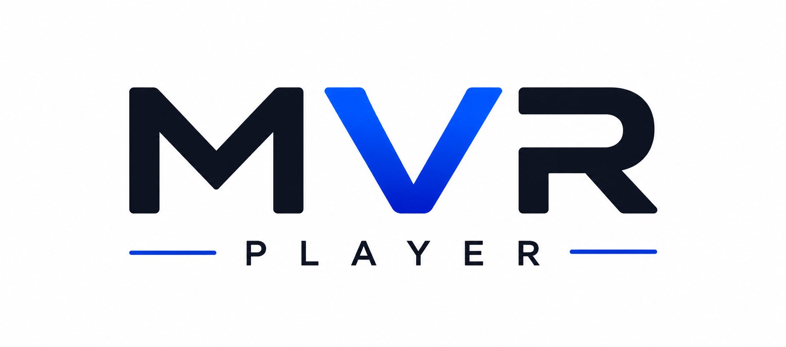
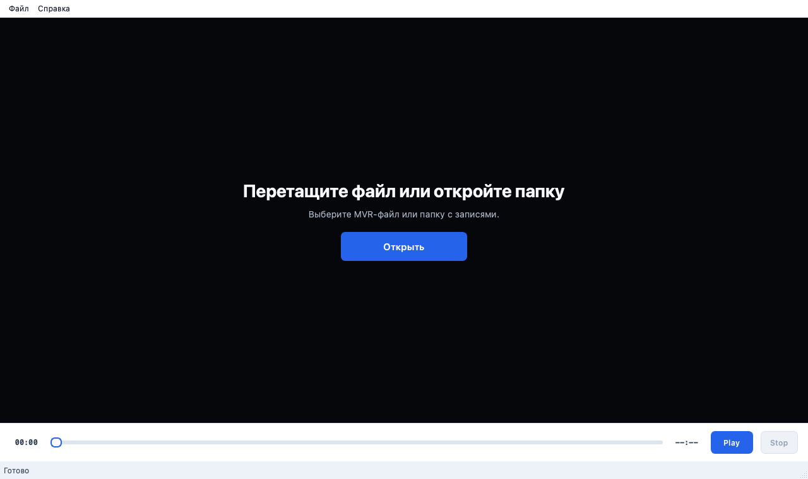

<p align="center">
  
</p>

<h1 align="center">MVR Player</h1>

<p align="center">
  Удобная программа для просмотра файлов <code>.mvr</code> и сохранения видео в формате <code>.mp4</code>.
</p>

<p align="center">
  <a href="https://github.com/agaell/mvr-player/releases/latest">
    
  </a>
  
  
  <a href="LICENSE">
    
  </a>
</p>

MVR Player позволяет просматривать видеофайлы в формате <code>.mvr</code>, быстро 
перемещаться по видео и при необходимости конвертировать его в привычный формат <code>.mp4</code>.
Для начала работы скачайте последнюю версию программы и откройте файл для просмотра.

## Скачать

### [Скачать последнюю версию MVR Player](https://github.com/agaell/mvr-player/releases/latest)

1. Откройте страницу последнего Release.
2. Скачайте файл для своей операционной системы.
3. Распакуйте архив.
4. Запустите MVR Player.


## Возможности

- просмотр видеофайлов в формате `.mvr`;
- быстрая навигация по видео;
- полноэкранный режим;
- выбор папки и поиск `.mvr` во всех вложениях;
- дерево найденных файлов с открытием одним нажатием;
- конвертация выбранного файла в `.mp4`;


## Скриншоты

<p align="center">
  
</p>

<p align="center"><em>Главное окно MVR Player</em></p>

## Как пользоваться

1. Запустите MVR Player.
2. Перетащите `.mvr` в окно или нажмите **Открыть**.
3. Выберите файл или папку с записями.
4. Если открыта папка, выберите нужное видео в панели справа.
5. Используйте шкалу времени и кнопки Play, Pause и Stop для просмотра.
6. Чтобы сохранить видео, нажмите **Конвертировать в MP4** и выберите папку.

Двойное нажатие по видео включает полноэкранный режим. Для выхода нажмите
`Esc` или снова дважды нажмите по видео.

## Сборка

Понадобится Python 3.9 или новее:

**macOS и Linux**

```bash
git clone https://github.com/agaell/mvr-player.git
cd mvr-player
python -m venv .venv
source .venv/bin/activate
python -m pip install -e .
python -m mvr_player.main
```

**Windows**

```powershell
git clone https://github.com/agaell/mvr-player.git
cd mvr-player
py -m venv .venv
.venv\Scripts\Activate.ps1
python -m pip install -e .
python -m mvr_player.main
```

## Roadmap

- [x] Просмотр и управление воспроизведением `.mvr`.
- [x] Перемотка и полноэкранный режим.
- [x] Поиск файлов в папках и подпапках.
- [x] Конвертация в `.mp4` с отображением прогресса.
- [ ] Пакетная конвертация нескольких файлов.
- [ ] Расширение совместимости с вариантами формата MVR.
- [ ] Автоматическая проверка обновлений.
- [ ] Дополнительные языки интерфейса.

Предложения и сообщения об ошибках можно оставить в
[GitHub Issues](https://github.com/agaell/mvr-player/issues).

## Лицензия

MVR Player распространяется по лицензии [MIT](LICENSE). Программу можно
использовать, изменять и распространять с сохранением текста лицензии.
